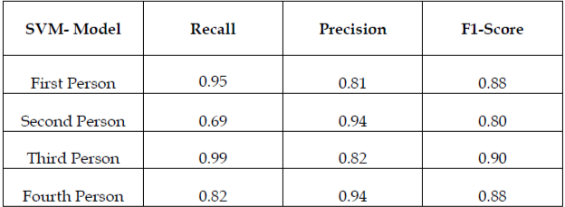
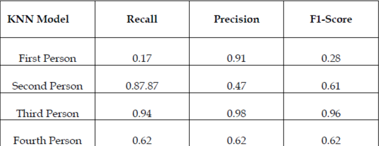
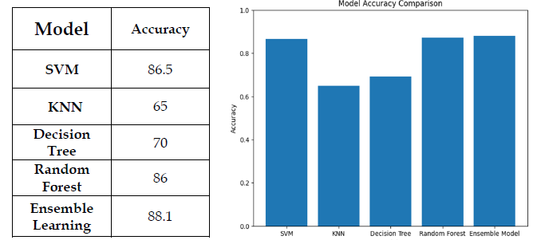

# EEG-based-Person-Identification-and-Authentication

<h1>Abstract</h1>

This research proposes a unique approach to biometric security by exploring the potential of using EEG signals for person authentication or identification. EEG signals obtained non-invasively from the scalp offer valuable insights into a human's brain functioning, making them a promising modality for identification. The project comprises three main stages: data acquisition, feature extraction, and classification. EEG information may be accrued from individuals even as they perform obligations or reply to stimuli. Sign processing techniques and time-domain, frequency-domain, and time-frequency analysis may be hired to extract relevant functions that seize the precise patterns of everyone's brain pastime. Machine learning algorithms such as support vector machines, random forests, and deep learning models will be trained to classify and differentiate between individuals based on their distinct EEG patterns.

<h1>Introduction</h1>

Person authentication, also known as user authentication or identity verification, is the process of confirming an individual’s identity to ensure that they are who they claim to be. The primary goal of person authentication is to prevent unauthorized access, fraud, and identity theft by verifying the claimed identity against a known or pre-registered identity. It involves using different authentication factors or methods to establish the legitimacy of an individual’s identity.

<h1>Methodology</h1>
<h2>Dataset Description</h2>
<ul>
  <li>File 1 – Baseline activity with eyes open</li>
  <li>File 2 – Baseline activity with eyes closed</li>
  <li>Files 3,7,11 – Task 1: Open and close the left or right fist</li>
  <li>Files 4,8,12 – Task 2: Imagine opening and closing the left or right fist</li>
  <li>Files 5,9,13 – Task 3: Open and close both fists or both feet</li>
  <li>Files 6,10,14 – Task 4: Imagine opening and closing both fists or both feet</li>
</ul>
<a href="https://physionet.org/content/eegmmidb/1.0.0/">Dataset</a>
<h2>Machine Learning Algorithms</h2>
<ul>
  <li>Support Vector Machine - SVM</li>
  <li>Decision Tree - DT</li>
  <li>Random Forest - RF</li>
  <li>K-Nearest Neighbour - KNN</li>
  <li>Ensemble Learning</li>
</ul>

